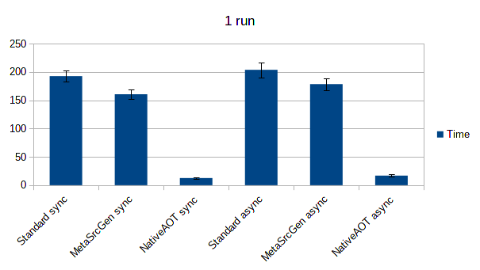
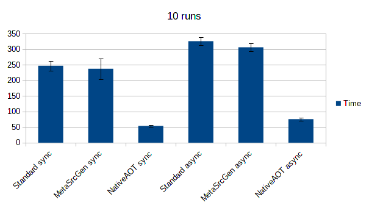
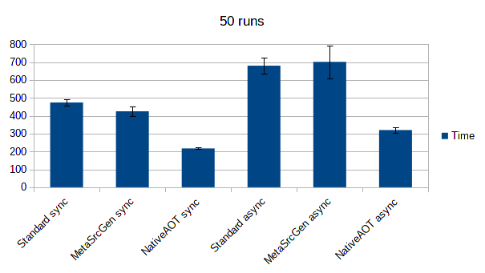
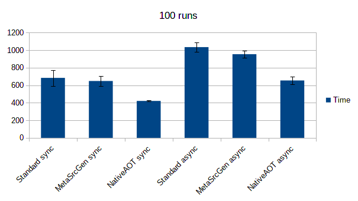
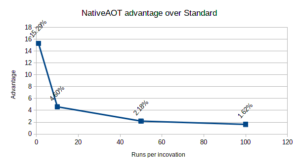
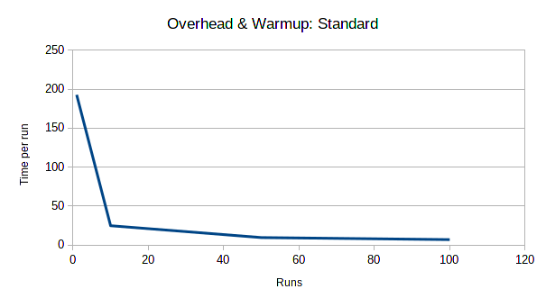
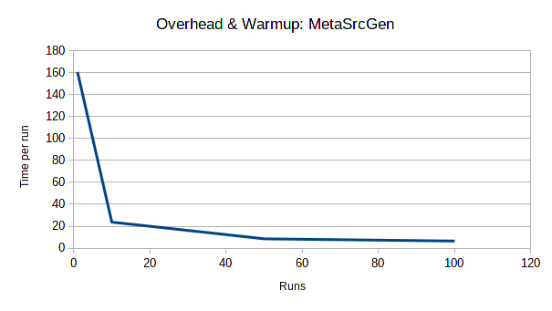
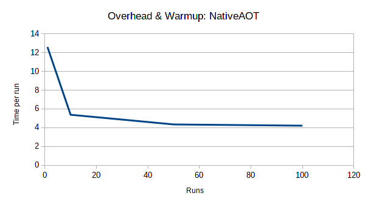

# JSON deserialisation tests in dotnet 7

Using `System.Text.Json`. All tests are done both synchronously and asynchronously.

The tests are run with a varying number of desers per program invocation to test how
the JIT is affecting the code using nativeaot as a consistent baseline.

## Standard

Your bog standard json deserialize.

## MetaSrcGen

Uses source generation in metadata mode. This circumvents reflection!

Using source generation in Serialization mode is not useful as this generates logic
for serializing types extremely fast, as opposed to deserializing types.

Using the default source generation mode will allow you both of these in a mixed test,
however this does not apply here and did not appear to perform different enough to bother
including.

## NativeAOT

This uses source generation to first remove the need for reflection,
then compiles the result down to native machine code without any dotnet runtime or IL
anywhere.

A new feature in the .NET 7 SDK.

## Results
See results-*.txt for hyperfine outputs.

Source generation yields a small improvement over naive usage in most cases.

At only one run per invocation, NativeAOT is a full order of magnitude faster,
however this quickly reduces (see advantage graph below) as the JIT can kick in and the
.NET runtime optimises the code.

NativeAOT does retain its advantage even once JIT is allowed to work, however.

Async is always slower than sync, however not enough so to change the ranking of the different methods.

## Pretty Graphs :D

Generated with LibreOffice, see attached ODS file.

I am quite stupid - please disregard the %s on the labels here.

It's 15x faster not 15% faster.

